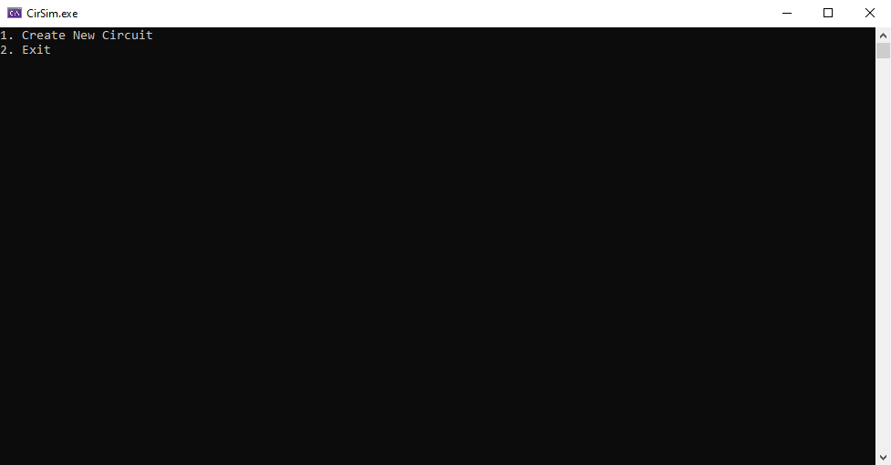
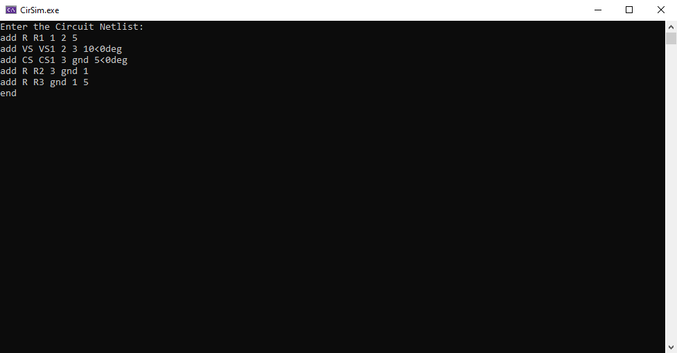
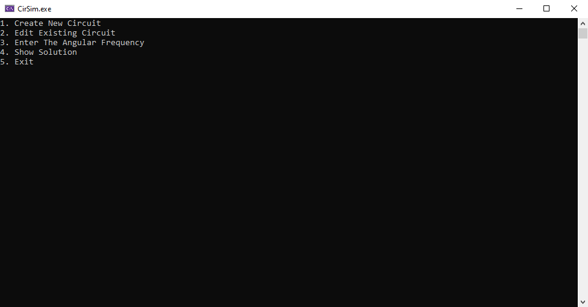

# Circuit-Solver
## About

This application solves  electrical circuits using **AC sinusoidal frequency domain analysis**. 
which means it calculates:
- **Nodal voltages** for every node.
- **Voltage difference** on each element.
-  **Current** through each element .
- **Power supplied** and/or **power dissipated** for each element in the circuit.

## Usage

### 1. Circuit Building Block

**Circuit-Solver** teats the circuit as a net list of elements *(resistors, voltage sources, etc.)* interconnected with each other.
#### Element Types
- Node
- Resistor
- Capacitor
- Inductor 
- Short Circuit
- Voltage Source
- Current Source
- Voltage Controlled Voltage Source
- Voltage Controlled Current Source
- Current Controlled Voltage Source
- Current Controlled Current Source

### 2. Circuit Naming

Before you insert the circuit you wish to solve, make sure that you name every element in the circuit.<br/>
**Note:** Names are ***case-insensitive*** and no two elements can have the same name unless they have different types.

### 3. Circuit Insertion

**Circuit-Solver** stores the circuit in the form of a net list of elements.

***3. 1. Insertion Format***<br/>
**Circuit-Solver** allows you to edit the stored net list using three operations and has this general input format:
```
OperationType ElementType ElementName [ElementData]
```
**Note:** OperationType, ElementType, ElementName, and any string input in ElementData are converted to lowercase letters.<br/>

***3. 2. Insertion Operation***<br/>
**Circuit-Solver** have three insertion-related operations:
- **add:** Adds a new element into the circuit net list.
- **rmv:** Removes an existing element in the circuit net list.
- **edt:**  Edits an existing element in the circuit net list.
- **end:** Ends the insertion and saves the net list.

***3. 3. Element Input***<br/>
**Circuit-Solver** have many elements but any element input starts with a string indicating its type and then is followed by the name of the element and then the element data which depends on the type of element and operation type.<br/>

**Insertion Input Example**
```
add cs I1 1 4 20K<1.02rad
edt cs I1 1 4 30+50iK
add r R1 1 4 8
add r R2 1 2 4
add r R3 2 3 5
add r R4 3 4 6
rmv r R1
edt r R2 1 2 5
end
```

#### Notes
- You must end your input with **end** operation.
- For more details on each operation input, check the documentation of the program.
- For details on each element input form, check the documentation of the program.
- You aren't required to input nodes individually, you can input only elements and **Circuit-Solver** will create the needed nodes for you.
- If you wish for a certain node to be the **ground**, let its name be "ground", otherwise the program will make the first source negative node be ground. If there's no source in the circuit, the program will take the ground as the first node entered.
- You can **edit** the circuit you have entered and change the ground node, or the input frequency.

## Documentation

### Operations

#### 1. Add
Operation String:
```
"add"
```
Input Form:
```
add ElementType ElementName ElementData
```
Input Example:
```
add C C1 1 2 20u
```
#### 2. Edit
Operation String:
```
"edt"
```
Input Form:
```
edt ElementType ElementName ElementNewData
```
Input Example:
```
edt C C1 1 2 40u
```
or
```
edt C C1 2 3 40u
```
**Note:** You can change any element data (e.g: PositiveNode, ElementValue, ControlElement, etc.) by entering new data.

#### 3. Remove
Operation String:
```
"rmv"
```
Input Form:
```
rmv ElementType ElementName
```
Input Example:
```
rmv C C1
```
### Elements 

#### 1. Node
Element Type String:
```
"n"
```
Element Input Format:
```
n Name
```
Input Example:
```
n Node1
```

#### 2. Resistor
Type String:
```
"r"
```
Input Format:
```
r Name PositiveNode NegativeNode Resistance
```
Input Example:
```
r Resistor1 Node1 Ground 20K 
```

#### 3. Capacitor
Type String:
```
"c"
```
Input Format:
```
c Name PositiveNode NegativeNode Capacitance
```
Input Example:
```
c Capacitor1 Node1 Ground 20u
```

#### 4. Inductor
Type String:
```
"l"
```
Input Format:
```
l Name PositiveNode NegativeNode Inductance
```
Input Example:
```
l Inductor1 Node1 Ground 20m
```

#### 5. Short Circuit
Type String:
```
"sc"
```
Input Format:
```
sc Name PositiveNode NegativeNode
```
Input Example:
```
sc Short1 Node1 Ground 
```

#### 6. Voltage Source
Type String:
```
"vs"
```
Input Format:
```
vs Name PositiveNode NegativeNode SupplyVoltage [InternalImpedance = 0]
```
Input Example:
```
vs Battery Positive Ground 9 
```

#### 7. Current Source
Type String:
```
"cs"
```
Input Format:
```
cs Name PositiveNode NegativeNode SupplyCurrent [InternalAdmittance = 0]
```
Input Example:
```
cs Current1 Positive Ground 5 
```

#### 8. Voltage Controlled Voltage Source
Type String:
```
"vcvs"
```
Input Format:
```
vcvs Name PositiveNode NegativeNode VoltageFactor ControlPositiveNode ControlNegativeNode [InternalImpedance = 0]
```
Input Example:
```
vcvs VolConVol1 Positive Ground 5 Positive1 Negative1  
```

#### 9. Voltage Controlled Current Source
Type String:
```
"vccs"
```
Input Format:
```
vccs Name PositiveNode NegativeNode VoltageFactor ControlPositiveNode ControlNegativeNode [InternalAdmittance = 0]
```
Input Example:
```
vccs VolConCur1 Positive Ground 5 Positive1 Negative1  
```

#### 10. Current Controlled Voltage Source
Type String:
```
"ccvs"
```
Input Format:
```
ccvs Name PositiveNode NegativeNode CurrentFactor ControlElementType ControlElementName [InternalImpedance = 0]
```
Input Example:
```
vcvs CurConVol1 Positive Ground 5 vs Battery   
```

#### 11. Current Controlled Current Source
Type String:
```
"cccs"
```
Input Format:
```
cccs Name PositiveNode NegativeNode CurrentFactor ControlElementType ControlElementName [InternalAdmittance = 0]
```
Input Example:
```
vccs CurConCur1 Positive Ground 5 vs Battery   
```

---

### Elements Values (Complex Values)

**Circuit-Solver** lets you input complex or real values in one of two ways:

**1. Cartesian Format**
Allowed Formats:
```
(real)[prefix]
(imag)i[prefix]
(real)+(imag)i[prefix]
(real)-(imag)i[prefix]
(imag)i+(real)[prefix]
(imag)i-(real)[prefix]
```
Input Example:
```
50
30i
50+30iK
```
**Note:** You put the prefix at the end of the Cartesian form input.

**2. Polar Format**
Allowed Formats:
```
(mag)[prefix]<(angle)		//degrees
(mag)[prefix]<(angle)rad	//radians
(mag)[prefix]<(angle)deg	//degrees
```
Input Example:
```
10<20rad
10K<20deg
```
**Note:** You put the prefix after magnitude input in the Polar form input.

---

### Elements Values Prefixes

**Circuit-Solver** lets you specify a prefix to scale values.

#### Allowed Prefixes

Prefix | Abbreviation | Scale
------ | ------------ | -----
pico   | p            |	
nano   | n            |	
micro  | u            |	
milli  | m            |	
kilo   | K            |	
mega   | M            |	
giga   | G            |	
tera   | T            |	

**Note:** kilo, mega, giga, and tera have capital abbreviations.


## ScreenShots







![Circuit Solution]/CirSim/Gallery/Screenshot4.png)
